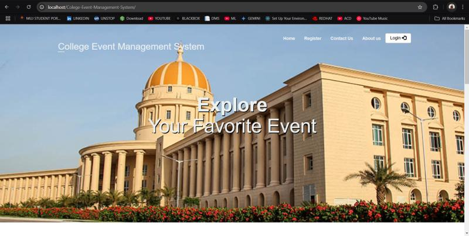

# 🎉 Event Aggregation Site

A web-based platform for streamlined event management at educational institutions. It enables admins, staff, and students to organize, manage, and register for events, all from a single portal.



## ✨ Features

- 🛠️ **Admin Panel:** Manage all events, users, and view registrations.
- 🧑‍🏫 **Staff Coordinator Interface:** Create/manage events, view participant details.
- 🧑‍🎓 **Student Coordinator Interface:** Help manage events and registrations.
- 📝 **User Registration:** Students register and track their event participation.
- 🔒 **Authentication System:** Secure login for all user types.
- 📅 **Event Listings:** See all upcoming and past events with details.

## 🖥️ Technologies Used

- 🎨 **Frontend:** HTML, CSS
- 🐘 **Backend:** PHP
- 💾 **Database:** MySQL

## 🚀 Getting Started

### 1. Clone the Repository

```bash
git clone https://github.com/tarun0714/Event_Aggregation_Site.git
```

### 2. Database Setup

- Import `cems.sql` into your MySQL server.

### 3. Configure the Server

- Place the folder in your web server root (e.g., `htdocs` for XAMPP).
- Make sure PHP and MySQL services are running.

### 4. Access the Application

Go to:  
`http://localhost/Event_Aggregation_Site/index.php`

## 🔑 Default Admin Credentials

- **Username:** admin
- **Password:** admin

*⚠️ Change these credentials after your first login!*

## 🗂️ Project Structure

```
Event_Aggregation_Site/
├── classes/                # PHP classes for DB operations
├── css/                    # Stylesheets
├── fonts/                  # Fonts used
├── images/                 # Image assets (add your screenshots here)
├── utils/                  # Utility scripts
├── cems.sql                # Database file
├── index.php               # Landing page
├── login_form.php          # Login interface
├── register.php            # Student registration
├── adminPage.php           # Admin dashboard
├── Staff_cordinator.php    # Staff coordinator view
├── Stu_cordinator.php      # Student coordinator view
├── events.php              # Events listing
├── createEventForm.php     # Create event form
├── viewEvent.php           # Event details
├── updateStaff.php         # Update staff details
├── updateStudent.php       # Update student details
├── deleteEvent.php         # Delete event
├── RegisteredEvents.php    # View registrations
├── aboutus.php             # About Us page
├── contact.php             # Contact page
└── readme.txt              # Extra notes
```

## 🤝 Contributing

Feel free to fork this repository and make pull requests for improvements or bug fixes.

## 📄 License

_No license has been specified for this project. Please contact the repository owner for usage permissions._

---

**Developed by [tarun0714](https://github.com/tarun0714).** 🚀
